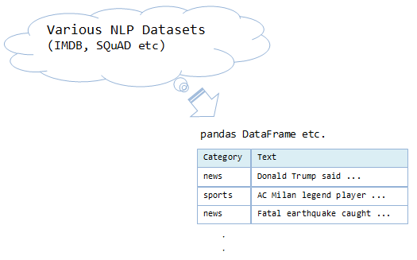
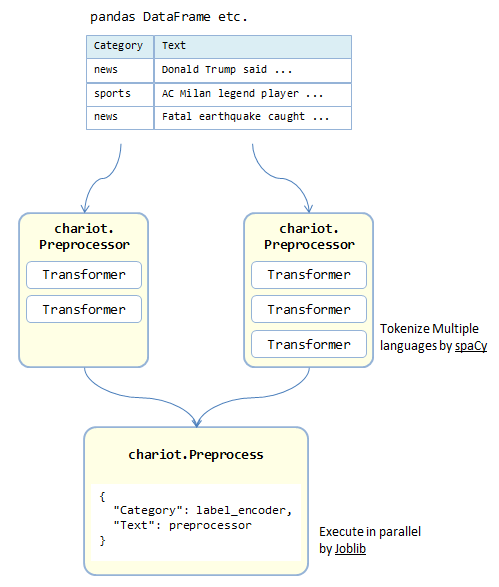
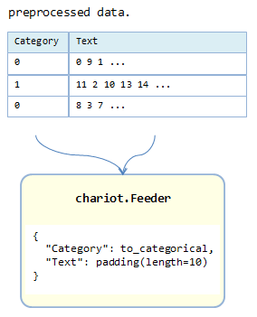
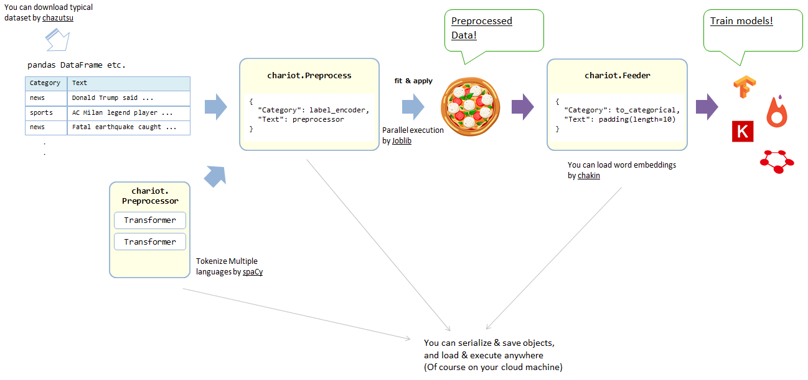

# chariot

**Deliver the ready-to-train data to your NLP model.**

* Prepare Dataset
  * You can prepare typical NLP datasets through the [chazutsu](https://github.com/chakki-works/chazutsu).
* Build & Run Preprocess
  * You can build the preprocess pipeline like [scikit-learn Pipeline](http://scikit-learn.org/stable/modules/generated/sklearn.pipeline.Pipeline.html).
  * Preprocesses for each dataset column are executed in parallel by [Joblib](https://pythonhosted.org/joblib/index.html).
  * Multi-language text tokenization is supported by [spaCy](https://spacy.io/).
* Format Batch
  * Sampling a batch from preprocessed dataset and format it to train the model (padding etc).
  * You can use pre-trained word vectors through the [chakin](https://github.com/chakki-works/chakin)

**chariot** enables you to concentrate on training your model!


## Install

```
pip install chariot
```

## Prepare dataset

You can download various dataset by using [chazutsu](https://github.com/chakki-works/chazutsu).  



```py
import chazutsu
from chariot.storage import Storage


storage = Storage("your/data/root")
r = chazutsu.datasets.MovieReview.polarity().download(storage.data_path("raw"))

df = storage.chazutsu(r.root).data()
df.head(5)
```

Then

```
	polarity	review
0	0	synopsis : an aging master art thief , his sup...
1	0	plot : a separated , glamorous , hollywood cou...
2	0	a friend invites you to a movie . this film wo...
```

`Storage` class manage the directory structure that follows [cookie-cutter datascience](https://drivendata.github.io/cookiecutter-data-science/).

```
Project root
  └── data
       ├── external     <- Data from third party sources (ex. word vectors).
       ├── interim      <- Intermediate data that has been transformed.
       ├── processed    <- The final, canonical data sets for modeling.
       └── raw          <- The original, immutable data dump.
```

## Build & Run Preprocess



### Build a preprocess pipeline

All preprocessors are defined at `chariot.transformer`.  
Transformers are implemented following to the scikit-learn transformer manner.  Thanks to that, you can chain & save preprocessors easily.


```py
from sklearn.externals import joblib
import chariot.transformer as ct
from chariot.preprocessor import Preprocessor


preprocessor = Preprocessor(
                  text_transformers=[ct.text.UnicodeNormalizer()],
                  tokenizer=ct.Tokenizer("en"),
                  token_transformers=[ct.token.StopwordFilter("en")],
                  vocabulary=ct.Vocabulary())

preprocessor.fit(your_dataset)
joblib.dump(preprocessor, "preprocessor.pkl")  # Save

preprocessor = joblib.load("preprocessor.pkl")  # Load
```

It means you don't need the code of preprocessor when inference (prediction).

There is 5 type of transformers for preprocessors.

* TextPreprocessor
  * Preprocess the text before tokenization.
  * `TextNormalizer`: Normalize text (replace some character etc).
  * `TextFilter`: Filter the text (delete some span in text stc).
* Tokenizer
  * Tokenize the texts.
  * It powered by [spaCy](https://spacy.io/) and you can choose [MeCab](https://github.com/taku910/mecab) or [Janome](https://github.com/mocobeta/janome) for Japanese.
* TokenPreprocessor
  * Normalize/Filter the tokens after tokenization.
  * `TokenNormalizer`: Normalize tokens (to lower, to original form etc).
  * `TokenFilter`: Filter tokens (extract only noun etc).
* Vocabulary
  * Make vocabulary and convert tokens to indices.

### Run preprocesses for each dataset column

After you prepare the preprocessors, you can apply these to your data in parallel.

```py
from chariot.preprocess import Preprocess


p = Preprocess({
    "Category": label_encoder,
    "Text": preprocessor
})

applied = p.apply(your_data)
```

You can apply multiple preprocessors to one column.

```py
from chariot.preprocess import Preprocess


p = Preprocess({
    "Category": label_encoder,
    "Text": {
      extract_word_features,
      extract_char_features,
    }
})
```

Of course, you can serialize and save `Preprocess` instance.

## Format Batch

`chariot` supports feeding the data to your model.



```py
from chariot.feeder import Feeder
from chariot.transformer.formatter import CategoricalLabel, Padding


feeder = Feeder({"Category": CategoricalLabel.from_(preprocessor),
                 "Text": Padding.from_(preprocessor, length=5)})

# Full batch
full_batch = feeder.apply(preprocessed)

# Iterate batch
for batch in feeder.iterate(preprocessed, batch_size=32, epoch=10):
    model.train_on_batch(batch["Text"], batch["Category"])

```

You can convert the word to vector by pre-trained word vectors by [chakin](https://github.com/chakki-works/chakin).  


```py
from chariot.storage import Storage
from chariot.transformer.vocabulary import Vocabulary

# Download word vector
storage = Storage("your/data/root")
storage.chakin(name="GloVe.6B.50d")

# Make embedding matrix
vocab = Vocabulary()
vocab.set(["you", "loaded", "word", "vector", "now"])
embed = vocab.make_embedding(storage.data_path("external/glove.6B.50d.txt"))
print(embed.shape)  # (len(vocab.count), 50)
```

Overall process is like following.


